<!-- HEADER -->
<div align="center">


<!-- TYPING SVG -->


<br/>

<!-- PROFILE VIEWS + FOLLOWERS -->


<br/>

<!-- SOCIAL LINKS -->
[](mailto:shivamarath2005@gmail.com)
[](https://www.linkedin.com/in/shiva-marath)
[](https://github.com/ShivaMarath)
[](#)

</div>

---

<!-- WHO AM I -->
## ⚡ `whoami`


```ts
const shiva: Developer = {
  name:       "Shiva Marath",
  age:        19,
  location:   "India 🇮🇳",
  focus:      [
    "full-stack development",
    "real-time systems",
    "AI-powered tooling",
  ],
  learning:   ["advanced TypeScript", "system design"],
  building:   "things that talk to each other in real time",
  openTo:     "collabs, open-source, and big ideas",
  funFact:    "I think in TypeScript & dream in WebSockets",
  contactAt:  "shivamarath2005@gmail.com",
};
```

<br clear="right"/>

---


<!-- DEVELOPER JOURNEY -->
## 🗺️ My Developer Journey

```mermaid
flowchart LR
    A([🌱 Origin\nCurious Kid · Age 14]) --> B & C

    B[💻 HTML · CSS · JS\nBuilding static pages]
    C[🐍 Python · C++\nAlgorithms & Logic]

    B --> D
    C --> D

    D[⚡ TypeScript\nType-safe thinking]

    D -->|went deep on UI| F[⚛️ React & Next.js\nComponent architecture\nUI/UX obsession]
    D -->|went deep on servers| G[🟢 Node.js · Express · Hono\nAPIs · REST · Auth]

    F --> H[🔗 Full-Stack\nEnd-to-end ownership]
    G --> H

    G -->|needed persistence| J
    F -->|needed state| J

    H --> I[⚡ WebSockets\nReal-time sync\nThings talking live]
    H --> J[🗄️ Data Layer\nPostgreSQL · MongoDB · Redis]

    I --> K
    J --> K

    I -->|powered by| P[📦 Monorepos · Turborepo\nShared libs · Clean DX]
    J -->|scaled with| P

    K[🤖 AI-Powered Tools\nTicket systems · Agents\nLLM integrations]

    K --> L[☸️ Docker · Kubernetes\nContainerised & orchestrated]
    K --> M[🔁 Inngest Workflows\nDurable jobs · Event-driven\nAsync backbone]

    L --> N
    M --> N
    P --> N

    N([🚀 NOW\nShipping real products\nAlways learning · Always building])

    style A fill:#0d1117,stroke:#007ACC,color:#c9d1d9,stroke-width:2px
    style N fill:#0d1117,stroke:#E36002,color:#c9d1d9,stroke-width:3px
    style B fill:#0d1117,stroke:#007ACC,color:#c9d1d9
    style C fill:#0d1117,stroke:#007ACC,color:#c9d1d9
    style D fill:#0d1117,stroke:#007ACC,color:#c9d1d9,stroke-width:2px
    style F fill:#0d1117,stroke:#5D5FEF,color:#c9d1d9
    style G fill:#0d1117,stroke:#5D5FEF,color:#c9d1d9
    style H fill:#0d1117,stroke:#5D5FEF,color:#c9d1d9,stroke-width:2px
    style I fill:#0d1117,stroke:#E36002,color:#c9d1d9
    style J fill:#0d1117,stroke:#5D5FEF,color:#c9d1d9
    style K fill:#0d1117,stroke:#E36002,color:#c9d1d9,stroke-width:2px
    style L fill:#0d1117,stroke:#E36002,color:#c9d1d9
    style M fill:#0d1117,stroke:#E36002,color:#c9d1d9
    style P fill:#0d1117,stroke:#5D5FEF,color:#c9d1d9

    linkStyle default stroke:#444,stroke-width:1.5px
```



---

<!-- TECH STACK - FULL MASSIVE SECTION -->
## 🛠️ Tech Stack & Arsenal

<div align="center">

### 💬 Languages


### 🎨 Frontend


### ⚙️ Backend


### 🗄️ Databases


### 🔁 Background Jobs & Workflows


> 🚀 **Inngest** — event-driven background jobs, scheduled functions & durable step workflows. Powers the async backbone of all my AI projects. No queue infra, no headaches.

### 🚀 DevOps & Cloud


### 🧰 Tools & Architecture


</div>

---


<!-- PROJECTS - CARD STYLE -->
## 🚀 Featured Projects

<div align="center">

<a href="https://github.com/ShivaMarath/AI_Ticket_System">
  
</a>
<a href="https://github.com/ShivaMarath/Sketch">
  
</a>

<br/>

<a href="https://github.com/ShivaMarath/chatapp-backend">
  
</a>
<a href="https://github.com/ShivaMarath/Ping_pong-websockets1">
  
</a>

<br/>

<a href="https://github.com/ShivaMarath/Byte">
  
</a>
<a href="https://github.com/ShivaMarath/Leetcode-Metric">
  
</a>

</div>

---

<!-- GITHUB STATS - FULL SUITE -->
## 📊 GitHub Stats

<div align="center">


<br/>


</div>

---

<!-- ACTIVITY GRAPH -->
## 📅 Contribution Activity

<div align="center">


</div>

---

<!-- RANDOM DEV QUOTE -->
## 💭 Today's Dev Quote

<div align="center">


</div>

---

<!-- SPOTIFY / VIBES -->
## 🎧 Coding Vibes

<div align="center">

> *"The best code is the code that ships."*

[](#)
[](#)


</div>

---


<!-- CONNECT -->
## 📫 Let's Build Something

<div align="center">


**I love connecting with other developers and builders.**
**Got an idea? Let's talk.**

<br/>

[](mailto:shivamarath2005@gmail.com)
[](https://www.linkedin.com/in/shiva-marath)
[](https://github.com/ShivaMarath)

<br/>


<br/>


</div>
